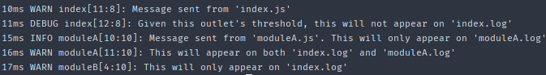
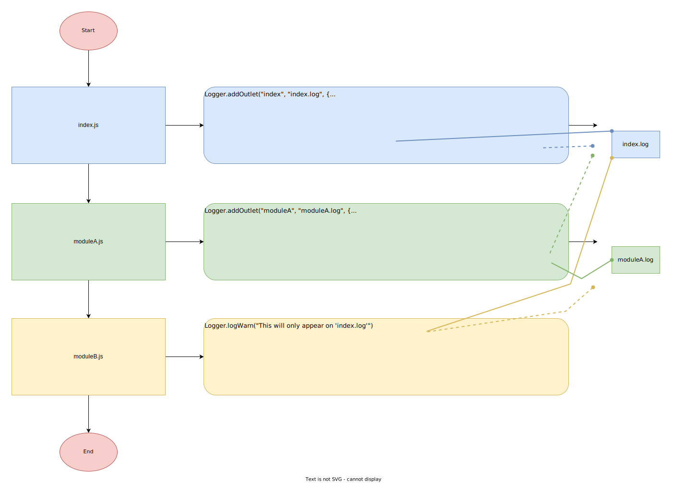

# LogUno

One logger, many outlets

- TypeScript supported
- CommonJS (Node.js) supported
- ECMAScript Modules (ESM) supported

[](https://www.npmjs.com/package/loguno)
[](https://npmcharts.com/compare/loguno?minimal=true)

## Table of Contents

- [Installation](#installation)
- [Example](#example)
- [Documentation](#documentation)
- [License](#license)

## Installation

```bash
npm i loguno # includes type definitions for TypeScript support
```

## Example

```
./
|__index.js
|__moduleA.js
|__moduleB.js
```

```js
/* index.js */
import { Level, Logger, Template } from "loguno";
import moduleA from "./moduleA";
import moduleB from "./moduleB";

Logger.addOutlet("index", "var/index.log", {
  isolated: false,
  threshold: Level.WARN,
  template: Template.dlom
});

Logger.logWarn("Message sent from 'index.js'");
Logger.logDebug("Given this outlet's threshold, this will not appear on 'index.log'");

moduleA();
moduleB();

/* moduleA.js */
import { Logger, Level, Template } from "loguno";

export default function main() {
  Logger.addOutlet("moduleA", "var/moduleA.log", {
    isolated: true,
    threshold: Level.TRACE,
    template: Template.lm
  });

  Logger.logInfo("Message sent from 'moduleA.js'. This will only appear on 'moduleA.log'");
  Logger.logWarn("This will appear on both 'index.log' and 'moduleA.log'");
}

/* moduleB.js */
import { Logger } from "loguno";

export default function main() {
  Logger.logWarn("This will only appear on 'index.log'");
}
```

```bash
node index.js
```

Since `Logger` starts with one outlet to `stdout` by default, running the above example would log 
the following to `stdout`:



The following diagram illustrates what happened:



## Documentation

See [here](doc/doc.md).

## License

[MIT](LICENSE)
